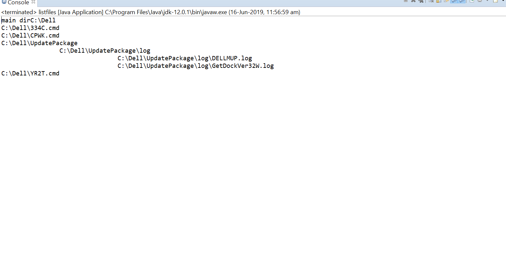
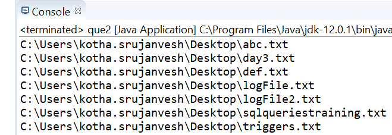
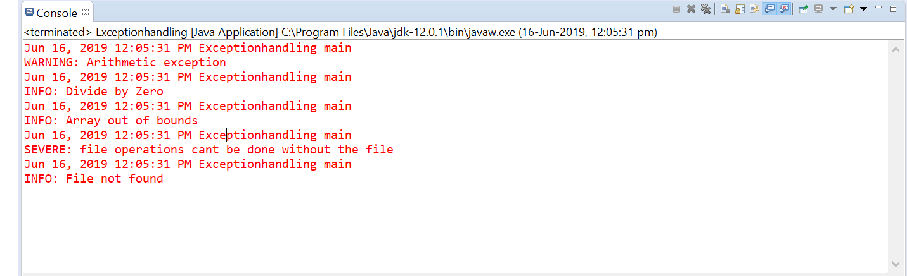

# FileIO 
## Excercise -1(List files in directory)

    [SOURCE->list files in directory.java]

###output

## Excercise -2(delete text files)

    [SOURCE->delete text files.java]

###output

# Exception Handling

## Excercise -1,2,3

    [SOURCE->ExceptionHandling.java]
    [OUTPUT-> logFile.txt, logFile2.txt]

###output
