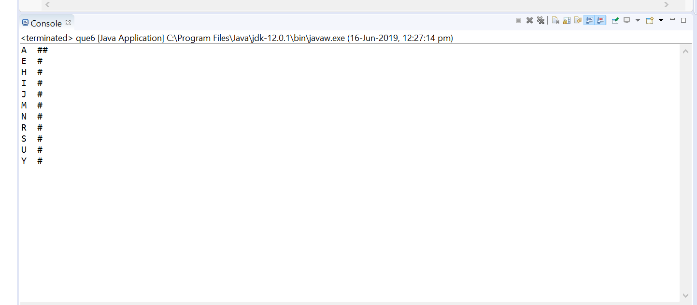
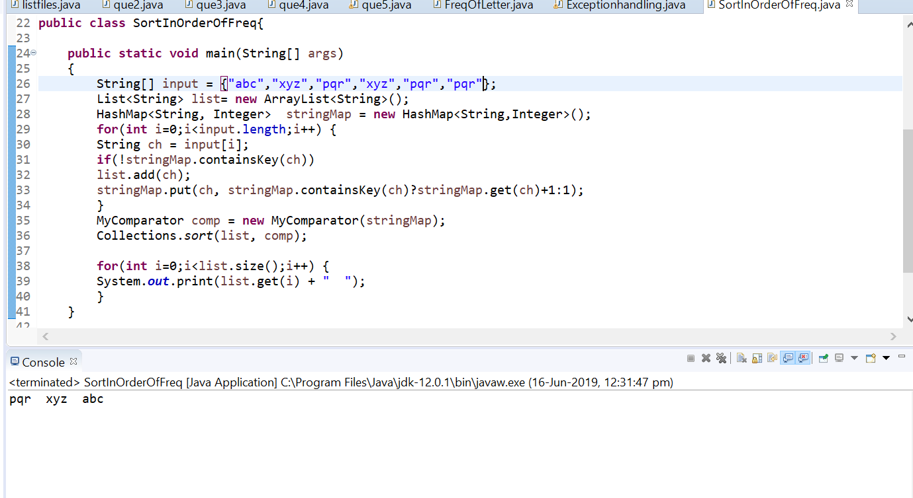
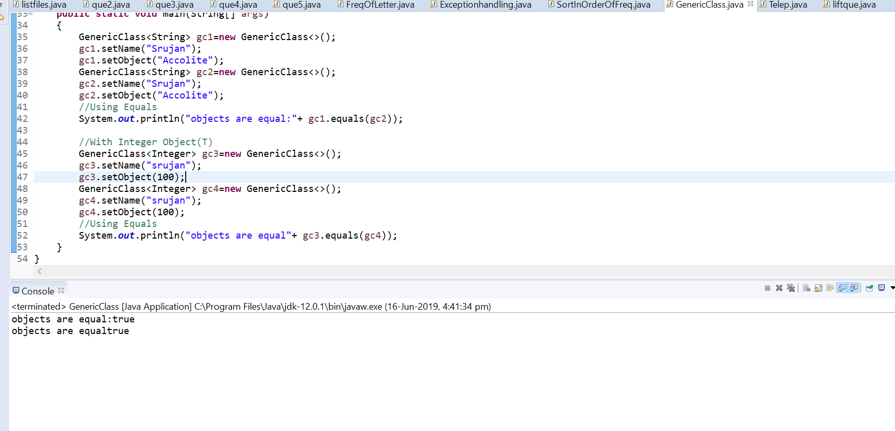

# Collections Assignment

## Excercise -1(Find frequency of each letter)

    [SOURCE->FreqOfLetter.java]

###output

## Excercise -2  (Generate another array containing distinct elements sorted in the order of their frequency)

    [SOURCE->SortInOrderOfFrequency.java]

###output

## Exercise -3(Generics)

    [SOURCE-> MyGenericClass.java]

### output
        